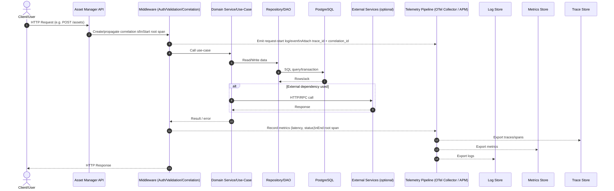

# Observability & Telemetry (Asset Manager)

This document describes the local observability stack, how telemetry flows through the system, and what signals are emitted. For the application repository layout, see [`../README.md`](../README.md) and [`../Server/SERVER_README.md`](../Server/SERVER_README.md).

---

## Stack overview

| Component | Role | Local port |
| --- | --- | --- |
| **Grafana Alloy** | OpenTelemetry collector: receives OTLP traces/metrics, tails log files, forwards to backends | gRPC `4317`, HTTP `4318`, UI `12345` |
| **Grafana Loki** | Log storage and query backend | `3100` |
| **Grafana Tempo** | Distributed trace storage | `3200` |
| **Prometheus** | Metrics storage; scrapes `/metrics` from the AMS server | `9090` |
| **Grafana** | Dashboards and visualization (pre-configured datasources: Loki, Tempo, Prometheus) | `3000` (published as `GRAFANA_PUBLISH_PORT`) |

## Folder structure

```
Observability/
├── loki-config.yaml              # Loki server config: filesystem storage, 30-day retention
├── tempo-config.yaml             # Tempo server config: OTLP receiver, local storage, 30-day retention
├── prometheus.yml                # Prometheus scrape config: scrapes AMS server /metrics every 10s
├── alloy/
│   └── config.alloy              # Alloy pipeline: log tailing, OTLP receiver, Prometheus remote write
├── grafana/
│   └── provisioning/             # Grafana datasource and dashboard provisioning files
├── .env.observability.example    # Template for observability stack env vars
├── .env                          # Local env file (git-ignored)
└── .env.production               # Production env file (git-ignored)
```

## Local setup

```bash
cd Observability
cp .env.observability.example .env   # fill in passwords and ports
docker compose up -d
```

After startup:

- **Grafana:** `http://localhost:3000` (or `GRAFANA_PUBLISH_PORT`)
- **Prometheus:** `http://localhost:9090`
- **Loki:** `http://localhost:3100`
- **Tempo:** `http://localhost:3200`
- **Alloy UI:** `http://localhost:12345`

## Environment variables

Copy `.env.observability.example` to `.env` and fill in values.

| Variable | Description |
| --- | --- |
| `GRAFANA_PUBLISH_PORT` | Host port for Grafana (default `11200` in production) |
| `OTLP_HTTP_PUBLISH_PORT` | Host port for Alloy OTLP/HTTP receiver (default `11400`) |
| `OTEL_ALLOWED_ORIGIN` | CORS allowed origin for browser traces (e.g. `http://your-org-host:11000`) |
| `AMS_SERVER_METRICS_TARGET` | Prometheus scrape target for AMS server (e.g. `ams-server:8000`) |
| `GRAFANA_DASHBOARD_ADMIN_USERNAME` | Grafana admin username |
| `GRAFANA_DASHBOARD_ADMIN_PASSWORD` | Grafana admin password |
| `GF_SECURITY_ADMIN_USER` | Grafana security admin user (same as above) |
| `GF_SECURITY_ADMIN_PASSWORD` | Grafana security admin password (same as above) |
| `GRAFANA_ALERT_SMTP_HOST_AND_PORT` | SMTP host:port for Grafana alert emails |
| `GRAFANA_ALERT_SMTP_SENDER_USERNAME` | SMTP sender username |
| `GRAFANA_ALERT_SMTP_SENDER_APP_PASSWORD` | SMTP sender app password |
| `GRAFANA_ALERT_NOTIFICATION_FROM_EMAIL_ADDRESS` | From address for Grafana alert emails |

## Telemetry pipeline

### Log pipeline (Alloy → Loki)

Alloy tails `../logs/ams_server.log` (mounted as `/app/logs/ams_server.log` in the container). It attaches static labels `service=ams-server, env=production` and extracts the `level` label via regex (`INFO|ERROR|WARNING|DEBUG|CRITICAL`). Logs are pushed to Loki at `http://loki:3100/loki/api/v1/push`.

The AMS server must write its stdout/stderr to `logs/ams_server.log` for Alloy to pick it up. In Docker Compose, this is done by redirecting the server's output.

### Trace pipeline (Alloy → Tempo)

Alloy receives OTLP traces on:
- gRPC `0.0.0.0:4317` — from the AMS Server (auto-instrumented via `opentelemetry-instrumentation-fastapi`)
- HTTP `0.0.0.0:4318` — from the React browser client (`src/otel-telemetry.ts`, only when `VITE_OTEL_GRAFANA_ENABLED=true`)

CORS is configured in `alloy/config.alloy` to allow the browser origin (`OTEL_ALLOWED_ORIGIN`). Traces are forwarded to Tempo at `tempo:4317`.

### Metrics pipeline (Alloy → Prometheus)

Two sources:
1. **OTLP metrics** received by Alloy from the AMS server are forwarded via `otelcol.exporter.prometheus` → `prometheus.remote_write`.
2. **Prometheus scrape** of `GET /metrics` on the AMS server (only exposed when `OTEL_GRAFANA_ENABLED=true` on the server). Scrape interval: 10 seconds.

### Server-side instrumentation

The AMS server uses `prometheus-fastapi-instrumentator` to expose `/metrics` when `OTEL_GRAFANA_ENABLED=true`. `RequestIdMiddleware` logs `request_completed` with `request_id`, `method`, `path`, `status_code`, and `elapsed_ms` for every request.

### Client-side instrumentation

`Client/src/otel-telemetry.ts` initializes the OpenTelemetry Web SDK when `VITE_OTEL_GRAFANA_ENABLED === 'true'`. It instruments `fetch` and `XMLHttpRequest` calls and exports traces via OTLP/HTTP to `VITE_OTEL_EXPORTER_ENDPOINT` (default `http://localhost:11400/v1/traces`). The service name is `ams-client`.

## API request flow



## Loki log query

The AMS server proxies Loki queries at `GET /observability/logs` (IT Ops role required). The client's `src/api/logsApi.ts` calls this endpoint — the browser never calls Loki directly.

Query parameters: `limit` (1–1000), `start`/`end` (nanoseconds), `service` (`ams-server` | `telemetry-server` | `all`), `level` (`error` | `warn` | `info` | `debug`), `cursor` (nanosecond timestamp for forward pagination).

### Loki label strategy

Alloy attaches low-cardinality labels to log streams:

| Label | Values |
| --- | --- |
| `service` | `ams-server`, `telemetry-server` |
| `env` | `production` |
| `level` | `INFO`, `ERROR`, `WARNING`, `DEBUG` |

High-cardinality values (user IDs, request IDs, trace IDs, asset tags) are kept as **log fields** (JSON properties), not labels, to avoid cardinality explosion.

### Example LogQL patterns

```logql
# All errors from the AMS server
{service="ams-server", level="ERROR"}

# Filter by correlation ID (as a field, not a label)
{service="ams-server"} |= "request_id=abc123"

# All logs from both services
{service=~"ams-server|telemetry-server"}
```

## Correlation IDs

Every HTTP response carries `x-request-id` (set by `RequestIdMiddleware` in `Server/core/middleware.py`). Send `X-Request-Id` on requests to correlate with server logs. The request ID is included in every `request_completed` log line.

To correlate logs with traces: find the `request_id` in a log line, then use the `trace_id` (if present) to pivot to Tempo in Grafana Explore.

## Retention

| Backend | Retention |
| --- | --- |
| Loki | 30 days (`loki-config.yaml`) |
| Tempo | 30 days / 720 hours (`tempo-config.yaml`) |
| Prometheus | Default (no explicit retention set in `prometheus.yml`) |

## Troubleshooting checklist

- **No logs in Loki:** confirm `logs/ams_server.log` exists and the server is writing to it. Check Alloy UI at `http://localhost:12345` for pipeline errors.
- **No traces in Tempo:** confirm `OTEL_GRAFANA_ENABLED=true` on the server and `VITE_OTEL_GRAFANA_ENABLED=true` on the client. Check CORS config in `alloy/config.alloy` matches the client origin.
- **No metrics in Prometheus:** confirm `OTEL_GRAFANA_ENABLED=true` on the server and `AMS_SERVER_METRICS_TARGET` is set correctly in the Observability `.env`.
- **`GET /observability/logs` returns 403:** the signed-in employee must have `role = 'it_ops'`.
- **`GET /observability/logs` returns 503:** the server cannot reach Loki at `LOKI_BASE_URL`. Confirm the observability stack is running and the server is on the `ams-observability` Docker network.

## Related

- [`../README.md`](../README.md) — project overview
- [`../Server/SERVER_README.md`](../Server/SERVER_README.md) — server env vars and middleware
- [`../DOCKER_DEPLOYMENT.md`](../DOCKER_DEPLOYMENT.md) — Docker port mapping and network setup
