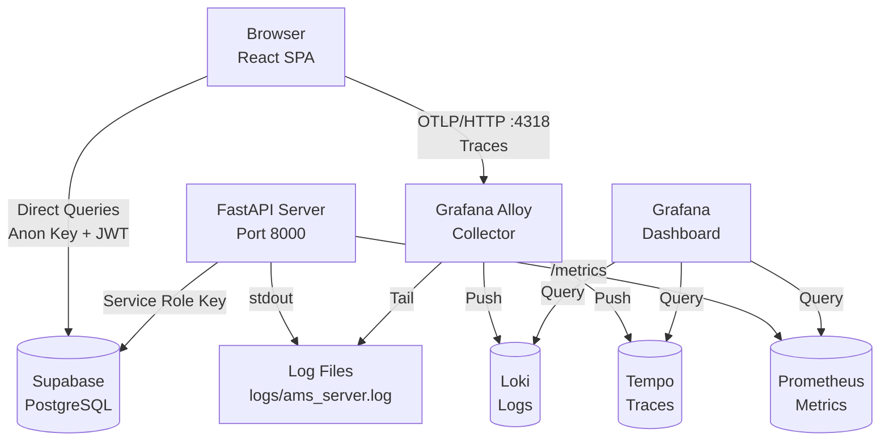
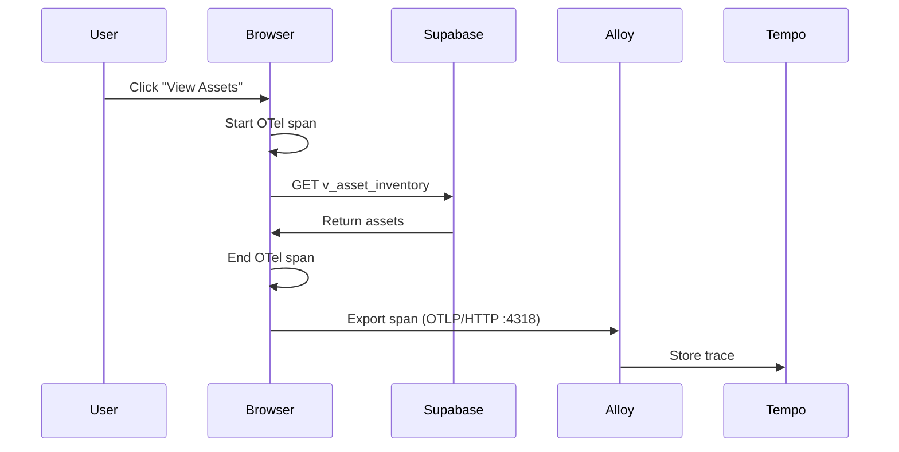
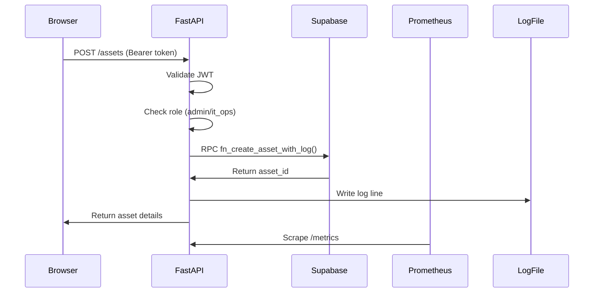

# Observability & Telemetry (Asset Manager)

This document describes the **actual implementation** of observability in the Asset Manager system, including how logs, metrics, and traces are collected and visualized through the Grafana stack.

## Actual Tech Stack

The Asset Manager uses a **Grafana OSS** stack with **OpenTelemetry** for comprehensive observability:

- **Frontend**: React 19 SPA with OpenTelemetry Web SDK (`src/otel-telemetry.ts`)
- **Backend**: FastAPI with Prometheus metrics (`prometheus-fastapi-instrumentator`)
- **Database**: Supabase (PostgreSQL 15+) - direct browser connection
- **Telemetry Standard**: OpenTelemetry (OTLP/HTTP for browser, OTLP/gRPC for server)
- **Collector**: Grafana Alloy 1.1.0 (receives OTLP and tails log files)
- **Traces Backend**: Grafana Tempo 2.4.0
- **Metrics Backend**: Prometheus 2.51.0
- **Logs Backend**: Grafana Loki 3.0.0
- **Visualization**: Grafana OSS 10.4.0

### Local Endpoints (Development)

- **Grafana Dashboard**: `http://localhost:3000` (default: admin/admin)
- **Prometheus**: `http://localhost:9090`
- **Loki**: `http://localhost:3100`
- **Alloy UI**: `http://localhost:12345`
- **Alloy OTLP gRPC**: `localhost:4317` (for server auto-instrumentation)
- **Alloy OTLP HTTP**: `localhost:4318` (for browser OpenTelemetry Web SDK)

### Grafana Data Sources (Auto-Provisioned)

Located in `grafana/provisioning/datasources/datasources.yaml`:
- **Prometheus** - scrapes `/metrics` from FastAPI server
- **Loki** - receives logs from Alloy (tails `logs/ams_server.log`)
- **Tempo** - receives traces from Alloy (OTLP from browser and server)

### Credentials

Default Grafana: `admin` / `admin`  
Override via `.env.observability`:
```bash
GRAFANA_DASHBOARD_ADMIN_USERNAME=admin
GRAFANA_DASHBOARD_ADMIN_PASSWORD=your-secure-password
```

## Architecture (As Implemented)



## What We Actually Emit

### 1. Browser Traces (OpenTelemetry Web SDK)

**File**: `Client/src/otel-telemetry.ts`

**Enabled When**: `VITE_OTEL_GRAFANA_ENABLED=true`

**What Gets Traced**:
- All `fetch()` calls (auto-instrumented)
- All `XMLHttpRequest` calls (auto-instrumented)
- Service name: `ams-client`
- Exports to: `http://localhost:4318/v1/traces` (Alloy OTLP/HTTP)

**Span Attributes**:
- `http.method`: GET, POST, PUT, DELETE
- `http.url`: Request URL
- `http.status_code`: Response status

**Initialization**:
```typescript
// Called in App.tsx on mount
startOtelTelemetry();
```

### 2. Server Metrics (Prometheus)

**File**: `Server/main.py`

**Enabled When**: `OTEL_GRAFANA_ENABLED=true`

**Endpoint**: `GET /metrics` (Prometheus format)

**What Gets Exposed**:
```python
# Automatically instrumented by prometheus-fastapi-instrumentator
if settings.OTEL_GRAFANA_ENABLED:
    Instrumentator().instrument(app).expose(app, endpoint="/metrics")
```

**Metrics Available**:
- `http_request_duration_seconds` - Request latency histogram
- `http_requests_total` - Total request count by method, path, status
- `http_requests_in_progress` - Active requests

**Scraped By**: Prometheus every 15s (configured in `prometheus.yml`)

### 3. Server Logs (File Tailing)

**Source**: FastAPI stdout → `logs/ams_server.log`

**How It Works**:
1. Run server with output redirection:
   ```bash
   uvicorn main:app --host 0.0.0.0 --port 8000 >> ../logs/ams_server.log 2>&1
   ```
2. Alloy tails the file (configured in `alloy/config.alloy`)
3. Alloy pushes to Loki
4. Grafana queries Loki

**Log Format**: Plain text (FastAPI default logging)

**Alloy Configuration**:
```alloy
// Tails log files from ../logs directory
local.file_match "ams_logs" {
  path_targets = [{
    __path__ = "/app/logs/ams_server.log",
  }]
}

loki.source.file "ams_logs" {
  targets    = local.file_match.ams_logs.targets
  forward_to = [loki.write.default.receiver]
}
```

## Actual Data Flow

### Browser Request Flow



### Server Request Flow



## IT Ops Log Viewer

**Component**: `Client/src/components/pages/LogViewer.tsx`

**Route**: `/analysis` (Logs tab, IT Ops only)

**How It Works**:
1. Browser calls FastAPI: `GET /observability/logs?query={...}&limit=100`
2. FastAPI validates IT Ops role via `fn_is_it_ops()` RPC
3. FastAPI proxies request to Loki: `http://localhost:3100/loki/api/v1/query_range`
4. Loki returns log entries
5. FastAPI returns to browser
6. Browser displays logs in UI

**Authentication**: Requires `Authorization: Bearer <Supabase JWT>` with IT Ops role

**Query Examples**:
```logql
# All AMS server logs
{service="ams-server"}

# Error logs only
{service="ams-server"} |= "ERROR"

# Logs from last hour
{service="ams-server"} [1h]
```

## Request Correlation

**Implemented**: `X-Request-Id` header (via `RequestIdMiddleware`)

**File**: `Server/core/middleware.py`

**How It Works**:
1. Client sends request (optionally with `X-Request-Id` header)
2. Middleware generates or accepts request ID
3. Middleware adds `x-request-id` to response headers
4. Middleware logs request with request_id

**Usage**:
```python
# In middleware
request_id = request.headers.get("X-Request-Id") or str(uuid.uuid4())
response.headers["x-request-id"] = request_id
```

## Starting the Observability Stack

### 1. Start Grafana Stack

```bash
cd Observability
docker compose up -d
```

**Services Started**:
- Loki (port 3100)
- Tempo (internal only, accessed via Alloy)
- Prometheus (port 9090)
- Grafana (port 3000)
- Alloy (ports 12345, 4317, 4318)

### 2. Configure Client

```bash
# Client/.env
VITE_OTEL_GRAFANA_ENABLED=true
VITE_OTEL_EXPORTER_ENDPOINT=http://localhost:4318
VITE_GRAFANA_DASHBOARD_URL_FOR_ITOPS=http://localhost:3000/dashboards
```

### 3. Configure Server

```bash
# Server/.env
OTEL_GRAFANA_ENABLED=true
LOKI_BASE_URL=http://localhost:3100
```

### 4. Run Server with Log Redirection

```bash
cd Server
uvicorn main:app --host 0.0.0.0 --port 8000 >> ../logs/ams_server.log 2>&1
```

Or use the PowerShell script:
```powershell
cd Server
.\launch-otel-server.ps1
```

### 5. Run Client

```bash
cd Client
npm run dev
```

## Verification Checklist

### ✅ Metrics Working

1. Open `http://localhost:8000/metrics`
2. Should see Prometheus metrics:
   ```
   http_requests_total{method="GET",path="/health",status="200"} 5
   http_request_duration_seconds_bucket{...} 0.045
   ```

### ✅ Logs Working

1. Make a request to FastAPI
2. Check `logs/ams_server.log` - should have new log lines
3. Open Grafana → Explore → Loki
4. Query: `{service="ams-server"}`
5. Should see log entries

### ✅ Traces Working (Browser)

1. Open browser DevTools → Network
2. Navigate to `/assets` in the app
3. Open Grafana → Explore → Tempo
4. Search for recent traces
5. Should see `ams-client` spans with `fetch()` calls

### ✅ IT Ops Log Viewer Working

1. Sign in as IT Ops user
2. Navigate to `/analysis` → Logs tab
3. Should see live logs from Loki
4. Try filtering by log level or time range

## Troubleshooting

### Logs Not Appearing in Loki

**Check**:
1. Is Alloy running? `docker ps | grep alloy`
2. Does log file exist? `ls -la logs/ams_server.log`
3. Is Alloy tailing the file? Check Alloy UI at `http://localhost:12345`
4. Is Loki healthy? `curl http://localhost:3100/ready`

**Fix**:
```bash
# Restart Alloy
docker compose restart alloy

# Check Alloy logs
docker logs alloy
```

### Traces Not Appearing in Tempo

**Check**:
1. Is `VITE_OTEL_GRAFANA_ENABLED=true` in client `.env`?
2. Is Alloy receiving traces? Check Alloy UI
3. Is Tempo healthy? `docker ps | grep tempo`

**Fix**:
```bash
# Restart client with correct env
cd Client
npm run dev

# Check browser console for OTel errors
# Should see: "[OTel] OpenTelemetry Web SDK initialized"
```

### Metrics Not Appearing

**Check**:
1. Is `OTEL_GRAFANA_ENABLED=true` in server `.env`?
2. Is `/metrics` endpoint accessible? `curl http://localhost:8000/metrics`
3. Is Prometheus scraping? Check `http://localhost:9090/targets`

**Fix**:
```bash
# Restart server with correct env
cd Server
uvicorn main:app --reload --host 0.0.0.0 --port 8000
```

### IT Ops Log Viewer Shows "Forbidden"

**Check**:
1. Is user signed in?
2. Does user have `it_ops` role in `employees` table?
3. Is `LOKI_BASE_URL` correct in server `.env`?

**Fix**:
```sql
-- Promote user to IT Ops
UPDATE employees
SET role = 'it_ops'
WHERE email = 'user@company.com';
```

## Production Considerations

### Log Rotation

**Problem**: Log files grow unbounded

**Solution**: Use log rotation (logrotate on Linux, or Python RotatingFileHandler)

```python
# Server logging config
import logging.handlers

handler = logging.handlers.RotatingFileHandler(
    'logs/ams_server.log',
    maxBytes=100*1024*1024,  # 100 MB
    backupCount=30  # Keep 30 files
)
```

### Grafana Authentication

**Problem**: Default admin/admin credentials

**Solution**: Change in `.env.observability`:
```bash
GRAFANA_DASHBOARD_ADMIN_USERNAME=admin
GRAFANA_DASHBOARD_ADMIN_PASSWORD=your-secure-password
```

### Data Retention

**Current Settings**:
- Loki: 30 days (`loki-config.yaml`)
- Tempo: 30 days (`tempo-config.yaml`)
- Prometheus: 30 days (`prometheus.yml`)

**Adjust** in respective config files before starting stack.

## Summary

The Asset Manager observability stack is **fully implemented** with:

- ✅ Browser traces via OpenTelemetry Web SDK
- ✅ Server metrics via Prometheus
- ✅ Server logs via file tailing (Alloy → Loki)
- ✅ IT Ops log viewer in UI (FastAPI → Loki proxy)
- ✅ Grafana dashboards with auto-provisioned data sources
- ✅ Request correlation via `X-Request-Id` headers

All components are containerized and can be started with `docker compose up -d`.

