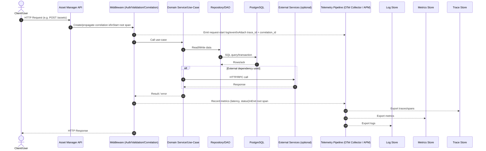

# Observability & Telemetry (Asset Manager)

This document describes **how API requests flow through the system** and **what telemetry we emit** (logs, metrics, traces) for debugging—especially in the context of PostgreSQL as the system of record. For the AMS application repository layout, see [`../README.md`](../README.md) and [`../Server/SERVER_README.md`](../Server/SERVER_README.md).

---

## Tech stack (observability-related)

This repo’s local observability stack is based on **Grafana OSS** and **OpenTelemetry** components.

- **API/Application**: Asset Manager API (HTTP)
- **Database**: PostgreSQL
- **Telemetry standard**: OpenTelemetry (logs, metrics, traces)
- **Telemetry collector**: Grafana Alloy (OpenTelemetry collector/distributor)
- **Traces backend**: Grafana Tempo
- **Metrics backend**: Prometheus
- **Logs backend**: Grafana Loki
- **Dashboards/Visualization**: Grafana

### Local endpoints (dev)

- **Grafana**: `http://localhost:3000`
- **Prometheus**: `http://localhost:9090`
- **Loki**: `http://localhost:3100`
- **Tempo**: `http://localhost:3200`
- **Alloy (collector)**: `http://localhost:12345`

### Grafana data sources (pre-configured)

- **Prometheus** (metrics)
- **Loki** (logs)
- **Tempo** (traces)

> Note: Credentials should be stored in environment/config (not documented in this file).

## Goals

- **Traceability**: follow a single request across services and dependencies.
- **Fast debugging**: correlate logs ↔ traces ↔ metrics using consistent identifiers.
- **Actionable signals**: SLO-friendly metrics (latency, error rate, saturation) with meaningful labels.

## API request flow (high level)



## What telemetry we should emit

### Traces

- **Root span** per inbound HTTP request.
- **Child spans** for:
  - auth/permission checks (if significant)
  - input validation (if significant)
  - service/use-case execution
  - database calls (queries + transactions)
  - external calls (HTTP/RPC)

**Minimum span attributes**

- **request**: `http.method`, `http.route`, `http.status_code`
- **identity** (when available): `enduser.id` (or internal user id), `tenant.id` (if multi-tenant)
- **correlation**: `trace_id`, `span_id`, plus an application-level `correlation_id` (see below)
- **db** (for PG spans): `db.system=postgresql`, `db.name`, `db.operation` (SELECT/INSERT/UPDATE/DELETE)

**Rules of thumb**

- Avoid high-cardinality attributes like full URLs with IDs, raw SQL text, emails, or filenames.
- For routes, prefer templated routes: `/assets/{id}` rather than `/assets/123`.

### Metrics

At minimum, publish these **request-level** metrics:

- **Request count**: `http.server.requests` (by route, method, status class)
- **Latency**: `http.server.duration` (histogram preferred; by route, method, status class)
- **Error rate**: derived from request count (4xx/5xx)

For database migration / Postgres validation, also publish:

- **DB latency**: `db.client.duration` (by operation + table where feasible)
- **DB errors**: count of exceptions/timeouts
- **Connection pool**: in-use, idle, wait time (if your driver/pool exposes it)

### Logs

Logs should be **structured** (JSON if possible) and contain:

- **correlation**: `correlation_id`, `trace_id`, `span_id`
- **request**: method, route, status, duration_ms
- **error**: message, type, stack (for server-side errors)

**Do not log** secrets or personal data:

- passwords/tokens/credentials
- full request bodies by default
- raw SQL with parameters that may contain sensitive fields

## App-proxy → Loki → Grafana (logs pipeline)

This section explains a common setup where the application sends logs to an **app-proxy** (sidecar / gateway / reverse proxy) which forwards them to **Loki**, and you view/search them in **Grafana**.

```mermaid
flowchart LR
  A[Asset Manager API\n(app container/process)] -->|stdout/stderr\nor HTTP log shipper| P[app-proxy\n(log gateway)]
  P -->|push API| L[(Loki)]
  L --> G[Grafana Explore / Dashboards]

  subgraph Metadata
    CID[X-Correlation-Id]
    TID[trace_id/span_id]
    LAB[labels: app, env, instance, route, level]
  end

  A -.-> CID
  A -.-> TID
  P -.-> LAB
```

### What the app-proxy is responsible for

- **Accept logs**: from app `stdout/stderr` (common in containers) or via an HTTP endpoint (if you ship logs over HTTP).
- **Parse/normalize**: ensure each log record is structured (JSON preferred) and has consistent fields.
- **Enrich**: attach or map metadata into Loki labels (keep labels low-cardinality).
- **Forward to Loki**: push batches to Loki with retry/backoff.

### Recommended Loki labels (keep them low-cardinality)

Good labels:

- **service/app**: `assetmanager-api`
- **env**: `dev` / `stage` / `prod`
- **instance**: pod/container name (bounded)
- **level**: `info`/`warn`/`error`

Avoid labels like:

- user id, correlation id, trace id
- request path with ids
- exception messages

Instead, keep those as **log fields** (JSON properties) so you can still search them without exploding label cardinality.

### How logs “appear” in Grafana

- The proxy writes logs to Loki streams identified by labels.
- Grafana connects to Loki as a datasource.
- In **Grafana Explore**, you query logs using LogQL, typically starting with labels, then filtering on fields.

Example query patterns (conceptual):

- **By service + environment**: `{service="assetmanager-api", env="prod"}`
- **Only errors**: `{service="assetmanager-api", env="prod"} |= "error"`
- **By correlation id (as a field, not a label)**: `{service="assetmanager-api", env="prod"} |= "correlation_id=..."`

### Correlation between Loki logs and traces

To jump from a log line to a trace, ensure each log includes:

- **`correlation_id`** (returned to clients as `X-Correlation-Id`)
- **`trace_id`** and **`span_id`** (from OpenTelemetry)

Then in Grafana you can:

- Search logs by `correlation_id`
- Open a log line and use `trace_id` to pivot to the tracing datasource (Tempo/Jaeger/vendor APM) if configured

## Correlation IDs (critical for debugging)

We use two related concepts:

- **trace_id/span_id**: generated by tracing SDKs and exported to the trace backend.
- **correlation_id**: an application-level request id we can pass to clients and logs.

### Recommended behavior

- On request entry:
  - If client provides `X-Correlation-Id`, **accept** it (validate length/charset).
  - Otherwise **generate** one.
- Return it in response header: `X-Correlation-Id`.
- Include it in every log line and as an attribute on the root span.

## Recommended instrumentation points

### Inbound HTTP (middleware)

- Start the root span.
- Attach/derive route name.
- Capture duration and status code.
- Ensure `correlation_id` is present and propagated.

### Database layer (repository/DAO)

- Wrap calls in spans (or rely on auto-instrumentation if enabled).
- Add safe attributes:
  - operation (SELECT/INSERT/UPDATE/DELETE)
  - entity/table name (avoid dynamic values)
- Record failures with exception details (without leaking parameters).

### External calls

- Inject trace context headers so downstream services can join the trace.
- Record dependency name and status.

## Useful dashboards (suggested)

- **API Overview**: RPS, p95/p99 latency, error rate by route.
- **Top slow routes**: sorted by p95 latency.
- **DB performance**: query latency distribution + error counts.
- **Dependency health**: external call latency + failure rate.

## Troubleshooting checklist

- **Have a `correlation_id`?**
  - Search logs by `correlation_id`.
  - Jump to the trace using `trace_id` found in the log line.
- **Seeing high latency?**
  - Check trace waterfall: DB span vs external call span vs app logic.
  - Compare route p95 vs DB p95.
- **Seeing errors?**
  - Verify status class distribution (4xx vs 5xx).
  - Check exception types and failing dependency spans.

## Quick verification (smoke test)

- Make a request to any endpoint.
- Confirm response includes `X-Correlation-Id`.
- Confirm logs include `correlation_id` and `trace_id`.
- Confirm a trace exists with child spans for DB calls.
- Confirm request metrics show up for the route.
