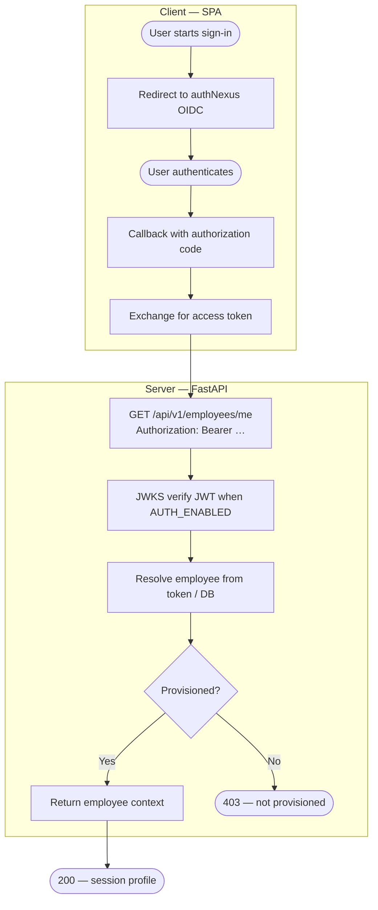

# Asset Manager

Asset Manager (AMS) is a **Postgres-backed** platform for physical and digital assets. The UI is a **React 19** single-page app (**Vite 7**); **authNexus** (OIDC) handles sign-in; a **FastAPI** backend serves **`/api/v1/*`** (and `GET /api/health`, `GET /observability/logs`) with JWT validation when auth is enabled, role checks, and audit-friendly mutations. Optional email notifications call an external microservice, and a local **Grafana** stack (under `Observability/`) can aggregate logs and traces.

This repository contains:

- `Client/` — React + Vite + TypeScript SPA (`Client/package.json`)
- `Server/` — FastAPI app (`Server/main.py`, `Server/app.py` re-exports `main.app`), asyncpg pool (`Server/core/postgres.py`), versioned API routers under `Server/routers/`
- `Observability/` — Docker Compose stack for Loki, Tempo, Prometheus, Grafana, Alloy (see `Observability/OBSERVABILITY_TELEMETRY.md`)

## Architecture

- The **browser calls the FastAPI server** for application data. Base URL: `VITE_API_URL` (default `http://localhost:8000` in `Client/src/utils/authNexus.api.ts`). Integration layers: `Client/src/api.ts`, `Client/src/api/apiClient.ts` + `Client/src/utils/authNexus.api.ts`, `Client/src/services/*`, `Client/src/queries/*`.
- **Sign-in** uses OIDC via `oidc-client-ts` (`Client/src/utils/authService.ts`, callback `Client/src/components/pages/AuthCallback.tsx`). The server validates access tokens (JWKS) when `AUTH_ENABLED=true` (`Server/core/auth_middleware.py`, `Server/core/authnexus.py`, `Server/core/settings.py`).
- **Postgres** holds application data. The pool is created from `DATABASE_URL` or from `POSTGRES_*` in `Server/core/postgres.py`. Business rules live in `Server/repositories/` and `Server/services/`.
- **SQL in this repo:** `Server/db/` contains optional, targeted scripts (for example `fn_next_asset_tag.sql`, `add_assets_qr_code.sql`, `v_warranty_notifications.sql`). They are **not** a full ordered migration history; your database must match the schema the repositories expect.
- The **email notification** microservice is external: the AMS server can POST to it when `NOTIFICATIONS_ENABLED=true` and URL/API key are set (`Server/core/settings.py`, `Server/services/notifications/`).
- **Observability:** `RequestIdMiddleware` logs `request_completed` with path and status (`Server/core/middleware.py`). The client can send OpenTelemetry browser traces when `VITE_OTEL_GRAFANA_ENABLED=true` (`Client/src/otel-telemetry.ts`). Loki is queried from the server at **`GET /observability/logs`** (IT Ops only; `Server/routers/observability.py`), not from the browser directly.

## Core domain rules

- **Nomenclature (UI):** **Asset Tag**, **Category**, **User** / employee context where the product uses those labels.
- **Roles (API):** `employee`, `admin`, `it_ops` (used in `Server/core/authz.py` and `Client/src/App.tsx` `RequirePrivileged`: any role other than `employee` is treated as privileged when `is_active` is true).
- **Flags:** `employees.is_active` and `employees.erp_active` are distinct; semantics are defined in the service/repository layer.
- **Public scan:** paths `/scan/:id` and authenticated `/assets/scan` / `/assets/scan/:id` use `Client/src/components/pages/ScanPage.tsx` with server routes under `/api/v1/assets` (see OpenAPI for exact contracts).
- **Recycle bin:** HTTP API is **`/api/v1/recycle-bin`** (`Server/routers/api_v1_recycle_bin.py`), not nested under the assets path prefix.

## Repository guides

- [`Client/CLIENT_README.md`](./Client/CLIENT_README.md) — client routes, env vars, file map
- [`Server/SERVER_README.md`](./Server/SERVER_README.md) — API modules, env vars, local run, DB scripts
- [`Server/services/README.md`](./Server/services/README.md) — service-layer modules
- [`Server/services/notifications/README.md`](./Server/services/notifications/README.md) — email adapter + orchestrator
- [`Observability/OBSERVABILITY_TELEMETRY.md`](./Observability/OBSERVABILITY_TELEMETRY.md) — local observability stack
- [`DOCKER_DEPLOYMENT.md`](./DOCKER_DEPLOYMENT.md) — Docker Compose for **server + client only**; Postgres is separate (e.g. `DB/DBassetManager.yml`)

## Local development

### Client

Create `Client/.env` (start from `Client/.env.example`), then:

```bash
cd Client
npm install
npm run dev
```

### Server

Create `Server/.env` (start from `Server/.env.example`), then:

```bash
cd Server
pip install -r requirements.txt
uvicorn main:app --reload --host 0.0.0.0 --port 8000
```

`Server/app.py` re-exports `main.app` for older `uvicorn app:app` style commands.

### Observability (optional)

```bash
cd Observability
docker compose up -d
```

### Docker (optional — app containers only)

Postgres stays **outside** this stack (for example `DB/DBassetManager.yml`). From repo root:

```bash
cd assetmanager
cp .env.docker .env   # then edit POSTGRES_* and VITE_*
docker compose up --build -d
```

See [`DOCKER_DEPLOYMENT.md`](./DOCKER_DEPLOYMENT.md) for `POSTGRES_HOST`, `VITE_API_URL`, and rebuild notes.

## Setup order

1. Provision **Postgres** and align schema with the code (use `Server/db/` helpers only as needed; apply any external migrations your team owns).
2. Configure **Client** `VITE_*` variables: API URL, authNexus, optional QR/telemetry (see `Client/CLIENT_README.md` and `Client/.env.example`).
3. Configure **Server** `POSTGRES_*` or `DATABASE_URL`, and auth per `Server/.env.example` if `AUTH_ENABLED=true`.
4. Start the server, then the client. Set **`FRONTEND_URL`** (server) to match the SPA origin used in server-generated links (e.g. PDF QR labels in `Server/services/qr_label_pdf_service.py`).

### Sign-in flow (high level)



## Notes

- **QR link origin (client):** `Client/src/utils/qr.ts` builds scan URLs with `VITE_FRONTEND_URL` or `VITE_PUBLIC_APP_ORIGIN`, then a production default. A separate `getScanPageBaseUrl` in `Client/src/api.ts` only checks `VITE_PUBLIC_APP_ORIGIN` for some API-layer QR helpers; keep env values consistent to avoid mismatch.
- **CORS / origins:** `Server/main.py` uses `settings.ALLOWED_ORIGINS` and may append `http://localhost:5174` if missing. Align with your Vite dev port.
- **Response header:** `x-request-id` is set on responses (`RequestIdMiddleware` in `Server/core/middleware.py`); you may send `X-Request-Id` to correlate.
- **Metrics:** when `OTEL_GRAFANA_ENABLED=true` on the server, Prometheus instrumentation exposes **`/metrics`** (`Server/main.py`).
