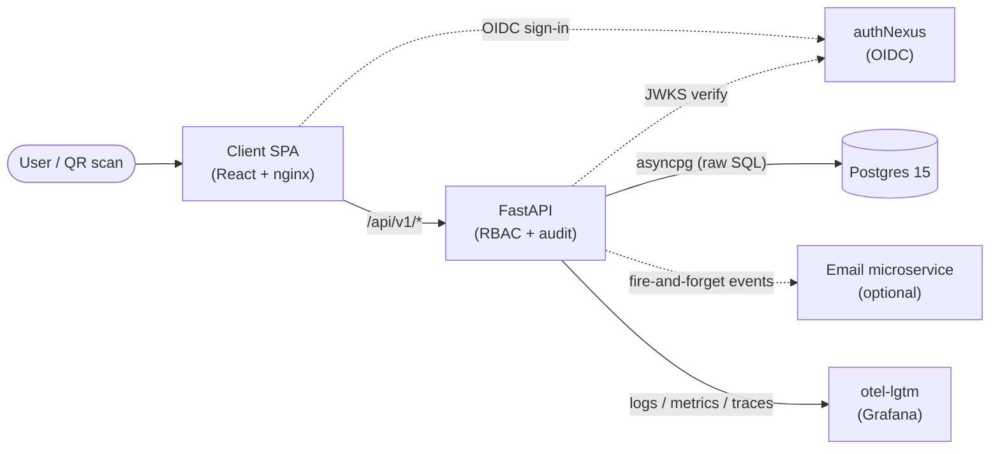

# Asset Manager (AMS)

Track physical & digital assets — QR-tagged, assign/return to employees, warranty alerts, audit
trail, bulk import/export, analytics. **React 19 + Vite** SPA · **FastAPI + asyncpg** API ·
**Postgres 15** · OIDC sign-in via **authNexus** (BFF HttpOnly-cookie refresh) · single
`grafana/otel-lgtm` container for logs/metrics/traces. nginx serves the client and reverse-proxies
`/api/`.

## Data flow



- Browser calls FastAPI for all data; nginx proxies `/api/` to the server.
- Sign-in is OIDC; the server validates RS256 JWTs via JWKS. `POST /api/auth/refresh` rotates the
  access token using the HttpOnly `nexus_refresh_token` cookie.
- Postgres is the system of record; business rules live in `Server/repositories/` + `Server/services/`.
  `DB/init.sql` is the authoritative schema.

## Performance — 500 active users ✅ tested & verified

Load-tested with `wrk -t8 -c500 -d20s` against `/api/v1/assets` (from inside the Docker network):

| Metric | Result |
| --- | --- |
| Throughput | **586 req/s** sustained, **0 failures** |
| Headroom | **~6×** (500 active users generate only ~60–90 req/s) |
| Latency (p50) | **577 ms** under 500 concurrent |
| Gain vs baseline | **172 → 586 req/s (3.4×)** after 4 uvicorn workers + PDF generation moved off the event loop |

## Repository layout

| Folder | Contains |
| --- | --- |
| `Client/` | React + Vite + TypeScript SPA |
| `Server/` | FastAPI app, asyncpg pool, versioned `/api/v1/*` routers |
| `DB/` | `init.sql` full schema |
| `Observability/` | otel-lgtm stack docs |
| `Notes/` | Product + authNexus reference docs |

## Domain rules (essentials)

- **Roles:** `employee`, `admin`, `it_ops` (server `core/authz.py`). Anything but `employee` is privileged.
- **Asset status:** `in_stock`, `assigned`, `in_repair`, `retired`, `lost`, `disposed`.
- **Asset tags:** auto-generated `AST-#####` in Postgres.
- **Public scan:** `/scan/:tag` (no auth) shows limited details; `/assets/scan/:tag` (authed) routes to
  the asset or its create form.
- **Audit:** every asset mutation (create/edit/assign/return/status/department) is recorded.

## Quick start (Docker)

```bash
cd assetmanager
# fill .env with POSTGRES_*, VITE_*, AUTH_*, FRONTEND_URL, ALLOWED_ORIGINS, ports
docker compose up --build -d
```

Client `:11000` · API `:11100` · Grafana `:11200` (see `.env`). Provision one employee with
`role='admin'` or `'it_ops'` for privileged routes.

## Local development

```bash
# DB
psql -U postgres -c "CREATE DATABASE assetmanager_db;"
psql -U postgres -d assetmanager_db -f DB/init.sql

# Server
cd Server && cp .env.example .env && pip install -r requirements.txt
uvicorn main:app --reload --port 8000

# Client
cd Client && cp .env.example .env && npm install && npm run dev   # http://localhost:5174
```

## Key environment variables

| Variable | Side | Purpose |
| --- | --- | --- |
| `POSTGRES_*` / `DATABASE_URL` | Server | Postgres connection |
| `AUTH_ENABLED` | Server | Enable JWT validation |
| `AUTH_JWKS_URL` / `AUTH_ISSUER` / `AUTH_AUDIENCE` | Server | JWT verify (`aud` must match token or 401) |
| `AUTH_AUTHORITY` | Server | authNexus base URL (used by `/api/auth/refresh`) |
| `FRONTEND_URL` / `ALLOWED_ORIGINS` | Server | QR PDF origin · CORS |
| `NOTIFICATIONS_ENABLED` | Server | Email microservice calls |
| `VITE_API_URL` | Client | API base URL |
| `VITE_AUTH_AUTHORITY` / `VITE_CLIENT_ID` / `VITE_PROJECT_ID` | Client | OIDC config |

## More docs

[Client](./Client/CLIENT_README.md) · [Server](./Server/SERVER_README.md) ·
[Database](./DB/README.md) · [Observability](./Observability/OBSERVABILITY_TELEMETRY.md) ·
[Docker](./DOCKER_DEPLOYMENT.md) · load-test detail in `Notes/api-load-test-500-users.md`.
