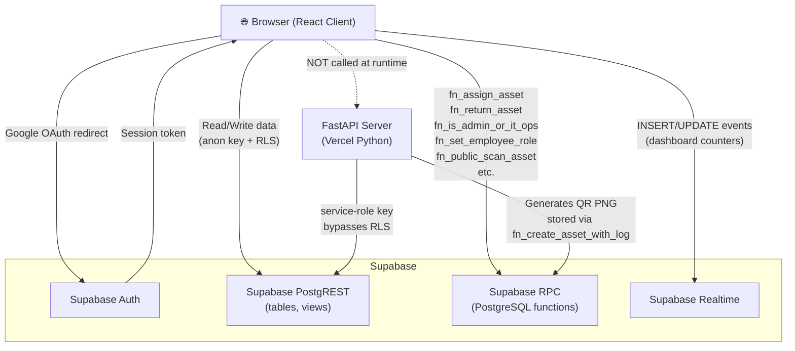

# [Asset Manager](https://web-assetmanager.vercel.app)

Centralized platform for tracking, managing, and auditing digital and physical assets — with ERP-aware employee profiles, RPC-driven assignment lifecycle, and QR-based asset scanning.

> [!NOTE]
> 🚧 **Under Development** — This project is actively being built. Features, APIs, and database schemas may change.

## Repository layout

```
assetmanager/
├── Client/   — React 19 + Vite + TypeScript frontend
└── Server/   — FastAPI backend (Supabase service-role, QR generation)
```

## Request flow



## Roles & database

Employees have a canonical `employees.role`: `employee`, `admin`, or `it_ops` (highest). RLS and RPCs enforce permissions; privileged role changes go through audited SQL (`fn_set_employee_role` / legacy wrapper). Apply migrations through `08_it_ops_rbac.sql` after the earlier core files — see [Server/db/migrations/v2/README.md](./Server/db/migrations/v2/README.md).

## Recent platform updates

- **Employee flags:** `employees.is_active` (employment / account) and `employees.erp_active` (ERP entitlement) are separate after migration `16_employee_erp_active.sql`. Assignment RPCs still require an **employment-active** employee; asset lists and scan copy use **ERP** for holder badges and “hide ERP-inactive” filters. The client defaults the employee directory to **employment active + ERP inactive** so that slice is easy to find; new-employee form defaults match unless you change the toggles.
- Notifications center at `/notifications` with role-aware warranty alerts (`employee` sees scoped alerts; `admin`/`it_ops` see all).
- First-sign-in welcome prompt support (DB RPC + client fallback).
- Soft delete for assets/employees (admin + IT Ops), with centralized Recycle Bin and restore workflow.
- Shared confirmation dialog for destructive actions (replaces browser confirm prompts).
- Shared refresh patterns across core pages (`RefreshButton` + refresh loader hook).

## Detailed documentation

- [`Client/CLIENT_README.md`](./Client/CLIENT_README.md) — full client reference (routing, pages, components, API layer, styles, deployment)
- [`Server/SERVER_README.md`](./Server/SERVER_README.md) — full server reference (routers, schemas, settings, auth, DB migrations, deployment)

## Quick start

```bash
# Client
cd Client && npm install && npm run dev

# Server
cd Server && pip install -r requirements.txt
uvicorn main:app --reload --host 0.0.0.0 --port 8000
```

## Deployment

Two separate Vercel projects — `Client/` and `Server/`. Each has its own `vercel.json` and environment variables. See the individual READMEs for exact env var checklists.

### Production URLs (example)

These are the live deployments for this fork; replace with your own domains if you self-host.

| Surface | URL | Notes |
| --- | --- | --- |
| Frontend (Vite) | `https://web-assetmanager.vercel.app` | Set as `FRONTEND_URL` on the server and in Supabase Auth redirect allowlist |
| Backend (FastAPI) | `https://assetmanager-backend.vercel.app` | API root; Swagger UI is at `/docs` — do **not** use `/docs` as the API base URL |

### Environment alignment

- **Client Vercel:** `VITE_SUPABASE_URL`, `VITE_SUPABASE_ANON_KEY` only (see [Client/CLIENT_README.md](./Client/CLIENT_README.md)).
- **Server Vercel:** `SUPABASE_URL`, `SUPABASE_KEY` (service role), `FRONTEND_URL` (must match the deployed client origin), `ALLOWED_ORIGINS` (comma-separated, include the client origin), `ENV=production`, and a non-empty `BACKEND_API_KEY` for internet-facing APIs (see [Server/SERVER_README.md](./Server/SERVER_README.md)).
- **Supabase:** Under Authentication → URL configuration, add the production site URL and redirect URLs for your client origin (e.g. `https://web-assetmanager.vercel.app` and `https://web-assetmanager.vercel.app/**` as needed).
