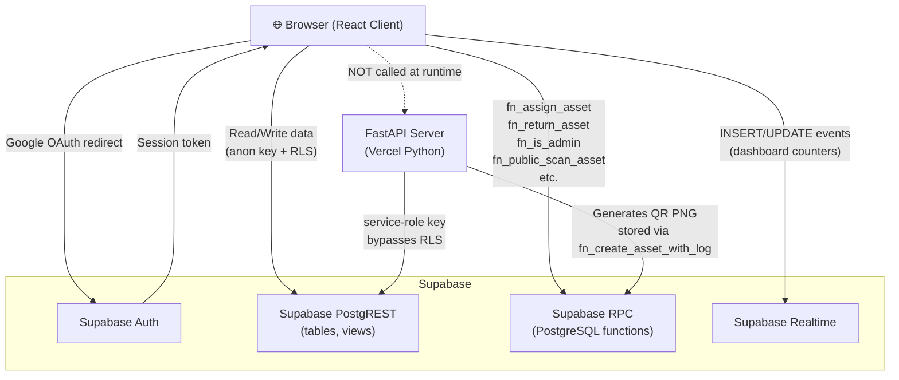

# Asset Management System (AMS)

Centralized platform for tracking, managing, and auditing digital and physical assets — with ERP-aware employee profiles, RPC-driven assignment lifecycle, and QR-based asset scanning.

> [!NOTE]
> 🚧 **Under Development** — This project is actively being built. Features, APIs, and database schemas may change.

## Repository layout

```
assetmanager/
├── Client/   — React 19 + Vite + TypeScript frontend
└── Server/   — FastAPI backend (Supabase service-role, QR generation)
```

## Request flow



## Detailed documentation

- [`Client/CLIENT_README.md`](./Client/CLIENT_README.md) — full client reference (routing, pages, components, API layer, styles, deployment)
- [`Server/SERVER_README.md`](./Server/SERVER_README.md) — full server reference (routers, schemas, settings, auth, DB migrations, deployment)

## Quick start

```bash
# Client
cd Client && npm install && npm run dev

# Server
cd Server && pip install -r requirements.txt
uvicorn main:app --reload --host 0.0.0.0 --port 8000
```

## Deployment

Two separate Vercel projects — `Client/` and `Server/`. Each has its own `vercel.json` and environment variables. See the individual READMEs for exact env var checklists.
