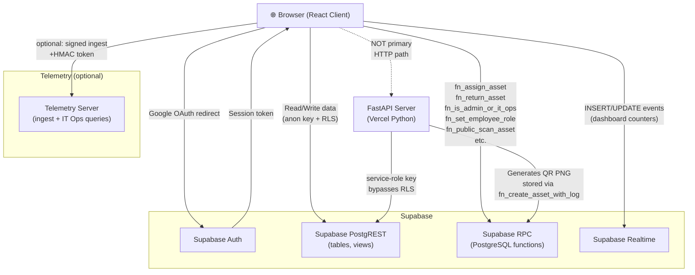

# [Asset Manager](https://web-assetmanager.vercel.app)

Centralized platform for tracking, managing, and auditing digital and physical assets — with ERP-aware employee profiles, RPC-driven assignment lifecycle, and QR-based asset scanning.

> [!NOTE]
> 🚧 **Under Development** — This project is actively being built. Features, APIs, and database schemas may change.

## Repository layout

```
assetmanager/
├── Client/          — React 19 + Vite + TypeScript frontend
├── Server/          — FastAPI backend (Supabase service-role, QR generation, telemetry ingest-token)
├── TelemetryServer/ — Standalone FastAPI service (event ingest, IT Ops query APIs; optional Vercel project)
└── Telemetry.plan.md — Architecture and rollout notes for engineering telemetry
```

## Request flow



## Roles & database

Employees have a canonical `employees.role`: `employee`, `admin`, or `it_ops` (highest). RLS and RPCs enforce permissions; privileged role changes go through audited SQL (`fn_set_employee_role` / legacy wrapper). Apply migrations through `08_it_ops_rbac.sql` after the earlier core files — see [Server/db/migrations/v2/README.md](./Server/db/migrations/v2/README.md).

## Recent platform updates

- **Asset bulk import:** On **`/assets/new`**, Admin/IT Ops can import standard-category assets from Excel (`AssetBulkImportModal`, `Client/src/utils/assetBulkImport.ts`). Each row calls the same **`createAsset`** RPC as the form; template `Client/public/asset-import-template.xlsx`. Row cap, strict headers, in-file duplicate (category + non-empty serial) preflight, and **`category_slug` must not appear in the sheet** when using the page’s selected category (Mode B). Details: [Client/CLIENT_README.md](./Client/CLIENT_README.md) (New Asset, Bulk import).
- **Client UI (latest):** Home uses a story-style landing layout (`HomeHero`, KPI story card, feature boxes, quick facts) with `getPublicDashboardSummary()` for a **signed-out** category preview only; **post-sign-in particle intro** runs once after real Google OAuth or `/login` redirect (sessionStorage marker + `INITIAL_SESSION` / `SIGNED_IN`, with a dev Strict Mode–safe bootstrap memo in `api.ts`). **All Assets** uses server-style **pagination** (`getAssetsPage`), an **advanced filters** popup (inventory status, category, ERP-inactive holder toggle), per-row **action menu** (view, QR, regenerate QR, soft-delete when permitted), and **`InventoryStatusBadge`** for status. **Footer** mirrors the hero content band (`max-w-[1320px]`). Main shell uses **`min-w-0` / `overflow-x-hidden`** on the scroll column so flex layout fills width beside the sidebar reliably.
- **Public QR scan:** Migration `17_fn_public_scan_minimal.sql` limits `fn_public_scan_asset` to basic fields (`asset_tag`, category, manufacturer, model, inventory `status`) and restores `qr_scanned` audit events. Full holder/location/custom data remains on authenticated asset views.
- **Employee flags:** `employees.is_active` (employment / account) and `employees.erp_active` (ERP entitlement) are separate after migration `16_employee_erp_active.sql`. Assignment RPCs still require an **employment-active** employee; asset lists and scan copy use **ERP** for holder badges and “hide ERP-inactive” filters. The client defaults the employee directory to **employment active + ERP inactive** so that slice is easy to find; new-employee form defaults match unless you change the toggles.
- Notifications center at `/notifications` with role-aware warranty alerts (`employee` sees scoped alerts; `admin`/`it_ops` see all).
- First-sign-in welcome prompt support (DB RPC + client fallback).
- Soft delete for assets/employees (admin + IT Ops), with centralized Recycle Bin and restore workflow.
- Shared confirmation dialog for destructive actions (replaces browser confirm prompts).
- Shared refresh patterns across core pages (`RefreshButton` + refresh loader hook).
- **Engineering telemetry (optional):** Client-side buffered events (`Client/src/telemetry.ts`) can POST to `TelemetryServer` using a short-lived HMAC token issued by `POST /telemetry/ingest-token` on the main `Server`. IT Ops–oriented query APIs and retention live on `TelemetryServer`; see [`Telemetry.plan.md`](./Telemetry.plan.md) and [`TelemetryServer/TELEMETRY_SERVER_README.md`](./TelemetryServer/TELEMETRY_SERVER_README.md).

## Detailed documentation

- [`Client/CLIENT_README.md`](./Client/CLIENT_README.md) — full client reference (routing, pages, components, API layer, telemetry env, styles, deployment)
- [`Server/SERVER_README.md`](./Server/SERVER_README.md) — full server reference (routers, telemetry token route, schemas, settings, auth, DB migrations, deployment)
- [`TelemetryServer/TELEMETRY_SERVER_README.md`](./TelemetryServer/TELEMETRY_SERVER_README.md) — ingest/query API, auth headers, Supabase Postgres (`telemetry` schema), Vercel notes
- [`Telemetry.plan.md`](./Telemetry.plan.md) — product and reliability design for IT Ops telemetry

## Quick start

```bash
# Client
cd Client && npm install && npm run dev

# Server
cd Server && pip install -r requirements.txt
uvicorn main:app --reload --host 0.0.0.0 --port 8000

# Telemetry (optional, separate process)
cd TelemetryServer && pip install -r requirements.txt
uvicorn main:app --reload --host 0.0.0.0 --port 8010
```

Configure `TELEMETRY_DATABASE_URL` (telemetry Supabase project) plus client env vars (`VITE_TELEMETRY_*`) and align `TELEMETRY_INGEST_TOKEN_SECRET` / `TELEMETRY_ENV` between `Server` and `TelemetryServer`. Run [`TelemetryServer/db/migrations/001_telemetry_schema.sql`](./TelemetryServer/db/migrations/001_telemetry_schema.sql) on that database first. Details: [`TelemetryServer/TELEMETRY_SERVER_README.md`](./TelemetryServer/TELEMETRY_SERVER_README.md).

**Scanning QRs from another device while developing:** default QR links use your current browser origin; `http://localhost:…` only works on that PC. Set `VITE_PUBLIC_APP_ORIGIN` in `Client/.env` to your LAN URL (e.g. `http://192.168.x.x:5173`), restart Vite, then create or refresh the asset QR. See [`Client/CLIENT_README.md`](./Client/CLIENT_README.md) (Environment variables + Running Locally). Production: optional override; align `FRONTEND_URL` on the server for server-generated QRs.

## Deployment

Up to **three** Vercel projects: `Client/`, `Server/`, and optionally `TelemetryServer/`. Each has its own `vercel.json` and environment variables. See the individual READMEs for exact env var checklists.

### Production URLs (example)

These are the live deployments for this fork; replace with your own domains if you self-host.

| Surface | URL | Notes |
| --- | --- | --- |
| Frontend (Vite) | `https://web-assetmanager.vercel.app` | Set as `FRONTEND_URL` on the server and in Supabase Auth redirect allowlist |
| Backend (FastAPI) | `https://assetmanager-backend.vercel.app` | API root; Swagger UI is at `/docs` — do **not** use `/docs` as the API base URL |
| Telemetry (FastAPI) | *(your deploy)* | Ingest base e.g. `https://…/telemetry/events`; see [TelemetryServer/TELEMETRY_SERVER_README.md](./TelemetryServer/TELEMETRY_SERVER_README.md) |

### Environment alignment

- **Client Vercel:** `VITE_SUPABASE_URL`, `VITE_SUPABASE_ANON_KEY` (see [Client/CLIENT_README.md](./Client/CLIENT_README.md)). If telemetry is enabled in production, also set `VITE_TELEMETRY_ENABLED`, `VITE_TELEMETRY_INGEST_URL`, and `VITE_TELEMETRY_TOKEN_URL` (full URL to the **main** backend’s `POST /telemetry/ingest-token`, not the Vite dev server).
- **Server Vercel:** `SUPABASE_URL`, `SUPABASE_KEY` (service role), `FRONTEND_URL` (must match the deployed client origin), `ALLOWED_ORIGINS` (comma-separated, include the client origin), `ENV=production`, and a non-empty `BACKEND_API_KEY` for internet-facing APIs; plus shared telemetry signing: `TELEMETRY_INGEST_TOKEN_SECRET`, `TELEMETRY_ENV`, `TELEMETRY_TOKEN_TTL_SECONDS` (see [Server/SERVER_README.md](./Server/SERVER_README.md)).
- **TelemetryServer Vercel (optional):** `TELEMETRY_DATABASE_URL`, `TELEMETRY_INGEST_TOKEN_SECRET` (must match main Server), `TELEMETRY_INGEST_SERVER_TOKEN`, `TELEMETRY_ITOPS_QUERY_KEY_NEW`, `TELEMETRY_ENV`, `TELEMETRY_ALLOWED_ORIGINS` (include the client origin for browser ingest). Use Supabase Postgres for durable storage — see [TelemetryServer/TELEMETRY_SERVER_README.md](./TelemetryServer/TELEMETRY_SERVER_README.md).
- **Supabase:** Under Authentication → URL configuration, add the production site URL and redirect URLs for your client origin (e.g. `https://web-assetmanager.vercel.app` and `https://web-assetmanager.vercel.app/**` as needed).
